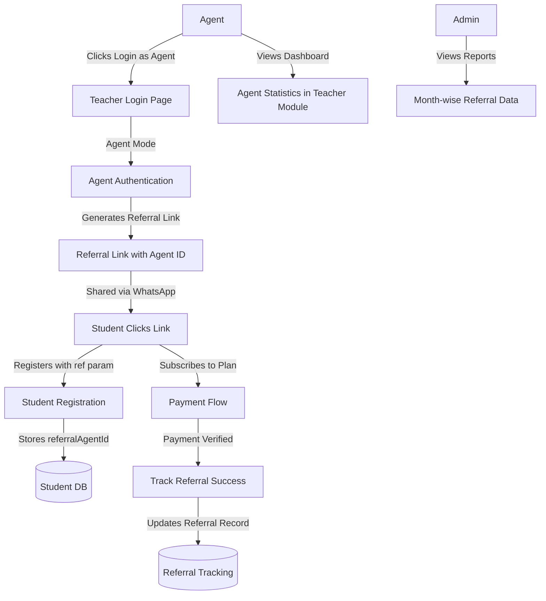

# Student Referral System Implementation Plan

## Overview

Implement a referral system where agents (separate user role) can refer students through WhatsApp links. Only students who register via referral AND subscribe to a plan are counted. Admins can view month-wise referral statistics for manual commission payments. **Agent functionality will be integrated into the teacher module** - agents will login through teacher module with "Login as Agent" option. **Agents cannot self-register** - only admins can create agents from the admin panel. Agents can only login if their account has been created by an admin.

## Architecture Flow

## Database Changes

### 1. Create Agent Model

**File:** `backend/models/Agent.js`

- Fields: name, phone, email, password, isActive, createdAt, updatedAt
- Similar structure to Teacher/Admin models
- Index on phone (unique)

### 2. Update Student Model

**File:** `backend/models/Student.js`

- Add field: `referralAgentId` (ObjectId ref to Agent, optional)
- Add field: `referredAt` (Date, when student registered via referral)
- Index on `referralAgentId` for efficient queries

### 3. Create ReferralRecord Model

**File:** `backend/models/ReferralRecord.js`

- Fields:
  - `agentId` (ref to Agent, required)
  - `studentId` (ref to Student, required)
  - `paymentId` (ref to Payment, required) - tracks which payment activated referral
  - `subscriptionPlanId` (ref to SubscriptionPlan)
  - `amount` (Number) - subscription amount paid
  - `subscriptionDate` (Date) - when subscription was activated
  - `status` (enum: 'pending', 'completed', 'paid') - for admin commission tracking
- Indexes: agentId, studentId, subscriptionDate (for month-wise queries)

### 4. Update Payment Model

**File:** `backend/models/Payment.js`

- Add field: `referralAgentId` (ObjectId ref to Agent, optional)
- Index on `referralAgentId` for statistics queries

## Backend Implementation

### 5. Agent Authentication & Routes

**File:** `backend/routes/agentRoutes.js` (new)

- POST `/api/agent/send-otp` - Send OTP to agent phone (only if agent exists and is active)
- POST `/api/agent/verify-otp` - Verify OTP and login
- GET `/api/agent/me` - Get agent profile
- PUT `/api/agent/me` - Update agent profile (limited fields)
- GET `/api/agent/referral-link` - Get agent's referral link
- GET `/api/agent/statistics` - Get agent's referral statistics

**Note:** No registration endpoint - agents are created by admin only.

### 6. Agent Controller

**File:** `backend/controllers/agentController.js` (new)

- `sendOTP` - Send OTP to agent phone (similar to teacher OTP flow). Check if agent exists and is active.
- `verifyOTP` - Verify OTP and return JWT token
- `getMe` - Get current agent profile
- `updateMe` - Update agent profile (limited fields like email, profile image - not phone/name)
- `getReferralLink` - Generate referral link with agent ID
- `getStatistics` - Get agent's referral stats (total referrals, successful subscriptions, month-wise breakdown)

**Note:** No registration method - agents are created by admin only.

### 7. Update Auth Middleware

**File:** `backend/middlewares/auth.js`

- Add 'agent' role support in `protect` middleware
- Import Agent model
- Handle agent authentication in token verification

### 8. Update Student Registration

**File:** `backend/controllers/studentController.js`

- Update `register` function:
  - Accept `referralAgentId` from query param or body
  - Validate agent exists and is active
  - Store `referralAgentId` and `referredAt` in student document

### 9. Update Payment Verification

**File:** `backend/controllers/paymentController.js`

- Update `verifyPayment` function:
  - Check if student has `referralAgentId`
  - If yes, create ReferralRecord entry:
    - Link to agent, student, payment
    - Store subscription details
    - Set status to 'completed'
  - Update Payment document with `referralAgentId`

### 10. Admin Agent & Referral Management

**File:** `backend/controllers/adminReferralController.js` (new)

- `createAgent` - Create new agent account (admin only). Fields: name, phone, email. Set isActive=true by default.
- `getAllAgents` - List all agents with basic stats (total referrals, successful subscriptions count)
- `getAgentById` - Get single agent details with full statistics
- `updateAgent` - Update agent details (name, phone, email, isActive status)
- `deleteAgent` - Delete/deactivate agent (soft delete - set isActive=false)
- `getAgentReferrals` - Get month-wise referral data for specific agent
- `getAllReferrals` - Get all referrals with filters (agent, month, status)
- `updateReferralStatus` - Mark referral as 'paid' when commission given
- `getReferralStatistics` - Aggregate statistics (total referrals, total amount, etc.)

**File:** `backend/routes/adminRoutes.js`

- Add routes for agent and referral management:
  - POST `/api/admin/agents` - Create new agent (admin only)
  - GET `/api/admin/agents` - List all agents
  - GET `/api/admin/agents/:id` - Get agent details
  - PUT `/api/admin/agents/:id` - Update agent
  - DELETE `/api/admin/agents/:id` - Delete/deactivate agent
  - GET `/api/admin/agents/:id/referrals` - Get agent's referrals
  - GET `/api/admin/referrals` - Get all referrals with filters
  - PUT `/api/admin/referrals/:id/status` - Update referral status
  - GET `/api/admin/referrals/statistics` - Get aggregate statistics

## Frontend Implementation (Teacher Module Integration)

### 11. Update Teacher Login Page

**File:** `frontend/src/modules/teacher/pages/Login.jsx`

- Add "Login as Agent" button/link below the main login form
- Add state to track login mode: 'teacher' or 'agent'
- When "Login as Agent" clicked:
  - Show agent login form (phone + OTP flow)
  - Use agent API endpoints instead of teacher endpoints
  - Check if agent exists before sending OTP (show error if agent not found)
  - After successful login, set user role to 'agent' in localStorage
  - Navigate to agent dashboard
- Show message: "Agent accounts are created by admin only. Contact admin if you need an agent account."

**Note:** No agent registration page - agents can only login if admin has created their account.

### 12. Add Agent Routes

**File:** `frontend/src/modules/teacher/constants/routes.js`

- Add agent routes:
  - `AGENT_LOGIN: '/teacher/login?mode=agent'` (or use state)
  - `AGENT_DASHBOARD: '/teacher/agent/dashboard'`
  - `AGENT_STATISTICS: '/teacher/agent/statistics'`
  - `AGENT_PROFILE: '/teacher/agent/profile'`

**Note:** No agent registration route - agents are created by admin only.

### 13. Add Agent API Methods

**File:** `frontend/src/modules/teacher/services/api.js`

- Add `agentAPI` object with methods:
  - `checkAgentExists(phone)` - Check if agent exists and is active
  - `sendOTP(phone)` - Send OTP to agent (only if agent exists)
  - `verifyOTP(phone, otp)` - Verify OTP and login
  - `getMe()` - Get agent profile
  - `updateMe(data)` - Update agent profile (limited fields)
  - `getReferralLink()` - Get referral link
  - `getStatistics()` - Get referral statistics

**Note:** No register method - agents are created by admin only.

### 14. Update Teacher AuthContext (or Create Agent Context)

**Option A:** Extend existing AuthContext

**File:** `frontend/src/modules/teacher/context/AuthContext.jsx`

- Add agent role support
- Check user role from token/localStorage
- Handle both teacher and agent authentication

**Option B:** Create separate AgentAuthContext

**File:** `frontend/src/modules/teacher/context/AgentAuthContext.jsx` (new)

- Similar structure to teacher AuthContext
- Handle agent-specific authentication

### 15. Agent Dashboard

**File:** `frontend/src/modules/teacher/pages/AgentDashboard.jsx` (new)

- Display statistics cards:
  - Total Referrals (students registered)
  - Successful Subscriptions (students who subscribed)
  - Pending Commissions (unpaid referrals)
- Referral Link Section:
  - Display referral link with copy button
  - WhatsApp share button (pre-filled message)
- Recent Referrals List (last 10)
- Month-wise breakdown chart/table
- Use same UI theme as teacher dashboard

### 16. Agent Statistics Page

**File:** `frontend/src/modules/teacher/pages/AgentStatistics.jsx` (new)

- Month-wise referral breakdown
- Filter by date range
- Export to CSV option (optional)
- Similar UI to teacher statistics/quizzes pages

### 17. Agent Profile Page

**File:** `frontend/src/modules/teacher/pages/AgentProfile.jsx` (new)

- Display agent information
- Edit profile option (limited - email, profile image only, not phone/name)
- Logout functionality
- Similar UI to teacher profile page

### 18. Update Bottom Navigation for Agent Mode

**File:** `frontend/src/modules/teacher/components/common/BottomNav.jsx`

- Check if user is agent (from context/localStorage)
- If agent, show agent-specific navigation:
  - Home (Agent Dashboard)
  - Statistics
  - Referrals
  - Profile
- If teacher, show existing teacher navigation

### 19. Update Student Registration

**File:** `frontend/src/modules/student/pages/RegistrationForm.jsx`

- Check URL for `?ref=agentId` query parameter
- Store referral agent ID in registration request
- Pass to backend API

### 20. Admin Agent Management

**File:** `frontend/src/modules/admin/pages/Agents/Agents.jsx` (new)

- **Create Agent Form:**
  - Form fields: Name, Phone, Email
  - "Create Agent" button
  - Validation for required fields
  - Success/error messages
- **Agents List:**
  - Display all agents in table/card format
  - Show: Name, Phone, Email, Status (Active/Inactive), Total Referrals, Successful Subscriptions
  - Actions: Edit, Deactivate/Activate, View Referrals, Delete
- **Edit Agent Modal/Page:**
  - Edit agent details (name, phone, email, isActive status)
  - Save changes

**File:** `frontend/src/modules/admin/pages/Agents/AgentReferrals.jsx` (new)

- View specific agent's referrals
- Month-wise breakdown
- Mark referrals as paid
- Export data

**File:** `frontend/src/modules/admin/pages/Referrals/ReferralReports.jsx` (new)

- All referrals overview
- Filter by agent, month, status
- Aggregate statistics
- Export functionality

## Key Implementation Details

### Referral Link Format

- Format: `https://app.dvisionacademy.com/register?ref={agentId}`
- For WhatsApp: Pre-filled message with link
- Example: "Join Dvision Academy! Register here: {link}"

### Agent Creation Flow (Admin)

1. Admin logs into admin panel
2. Navigates to "Agents" section
3. Clicks "Create Agent" button
4. Fills form: Name, Phone, Email
5. Submits form - agent account created with isActive=true
6. Agent receives credentials (phone number) and can login

### Login Flow for Agents

1. User visits `/teacher/login`
2. Clicks "Login as Agent" button
3. Enters phone number (agent phone)
4. System checks if agent exists and is active
5. If agent exists, receives OTP
6. Verifies OTP
7. If verified, redirects to agent dashboard
8. If agent doesn't exist, shows error: "Agent account not found. Contact admin to create your account."

### Referral Tracking Logic

1. Student clicks referral link → `ref` param stored in URL
2. Student registers → `referralAgentId` saved in Student document
3. Student subscribes → Payment verification creates ReferralRecord
4. Only successful subscriptions (status='completed') are counted

### Statistics Calculation

- **Total Referrals**: Count of students with `referralAgentId` matching agent
- **Successful Subscriptions**: Count of ReferralRecords for agent where status='completed'
- **Month-wise**: Group ReferralRecords by month of `subscriptionDate`

## Files to Create/Modify

### New Files (Backend)

- `backend/models/Agent.js`
- `backend/models/ReferralRecord.js`
- `backend/controllers/agentController.js`
- `backend/controllers/adminReferralController.js`
- `backend/routes/agentRoutes.js`

### Modified Files (Backend)

- `backend/models/Student.js` - Add referral fields
- `backend/models/Payment.js` - Add referralAgentId
- `backend/middlewares/auth.js` - Add agent role support
- `backend/controllers/studentController.js` - Handle referral in registration
- `backend/controllers/paymentController.js` - Create ReferralRecord on payment
- `backend/routes/adminRoutes.js` - Add referral management routes
- `backend/server.js` - Register agent routes

### New Files (Frontend - Teacher Module)

- `frontend/src/modules/teacher/pages/AgentDashboard.jsx`
- `frontend/src/modules/teacher/pages/AgentStatistics.jsx`
- `frontend/src/modules/teacher/pages/AgentProfile.jsx`
- `frontend/src/modules/teacher/context/AgentAuthContext.jsx` (if separate context needed)

**Note:** No AgentRegister.jsx - agents are created by admin only.

### Modified Files (Frontend - Teacher Module)

- `frontend/src/modules/teacher/pages/Login.jsx` - Add "Login as Agent" option
- `frontend/src/modules/teacher/pages/FinalOTP.jsx` - Handle agent OTP verification
- `frontend/src/modules/teacher/constants/routes.js` - Add agent routes
- `frontend/src/modules/teacher/services/api.js` - Add agentAPI methods
- `frontend/src/modules/teacher/context/AuthContext.jsx` - Add agent role support (or create separate)
- `frontend/src/modules/teacher/components/common/BottomNav.jsx` - Show agent navigation when agent logged in

### New Files (Frontend - Admin Module)

- `frontend/src/modules/admin/pages/Agents/Agents.jsx` - Main agent management page with create/edit/list functionality
- `frontend/src/modules/admin/pages/Agents/AgentReferrals.jsx` - View agent's referrals
- `frontend/src/modules/admin/pages/Referrals/ReferralReports.jsx` - All referrals overview

### Modified Files (Frontend - Admin Module)

- `frontend/src/modules/admin/services/api.js` - Add agent management API methods (createAgent, getAllAgents, updateAgent, deleteAgent, etc.)
- `frontend/src/modules/admin/pages/Dashboard.jsx` (optional) - Add link to Agents section

### Modified Files (Frontend - Student Module)

- `frontend/src/modules/student/pages/RegistrationForm.jsx` - Capture referral param

## Testing Considerations

- Test admin creating agent from admin panel
- Test agent login flow (only if account exists)
- Test error when trying to login with non-existent agent phone
- Test "Login as Agent" flow from teacher login page
- Test referral link generation and sharing
- Test student registration with referral param
- Test referral tracking on subscription
- Test agent statistics accuracy
- Test admin referral reports
- Test admin editing/deactivating agents
- Test navigation switching between teacher and agent modes
- Test edge cases (agent deactivated, duplicate referrals, etc.)

## Security Considerations

- Only admins can create agents - no public registration endpoint
- Validate agent exists and is active before allowing login
- Validate agent exists and is active before storing referral
- Prevent self-referral (agent referring themselves)
- Ensure only active agents can generate referral links
- Admin-only access to agent creation and referral management endpoints
- Separate authentication for agents (different JWT tokens)
- Agents cannot change their phone number or name (admin-only)